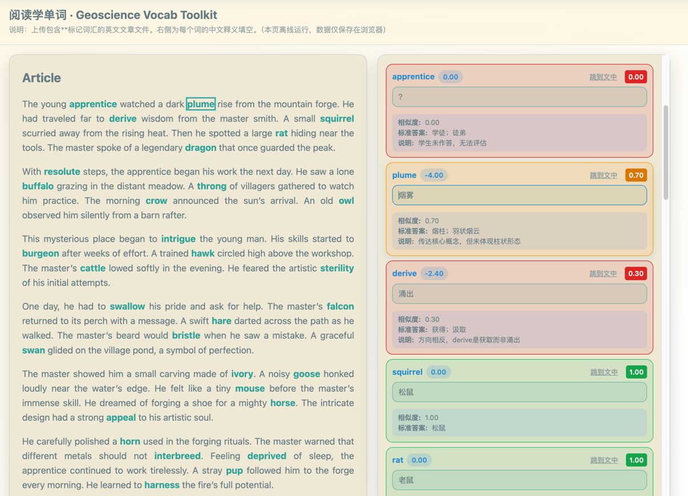
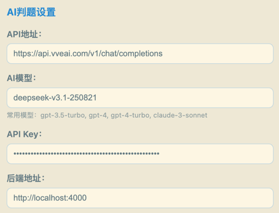
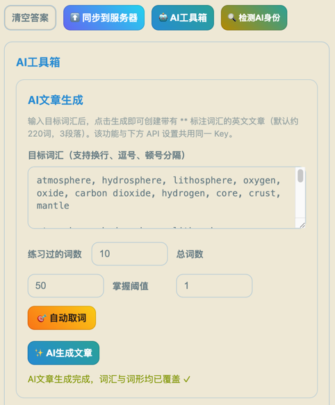
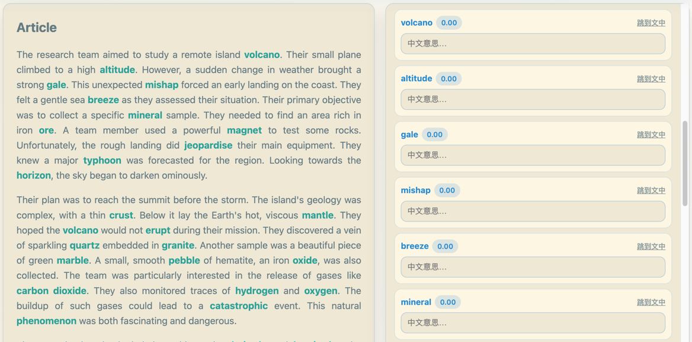
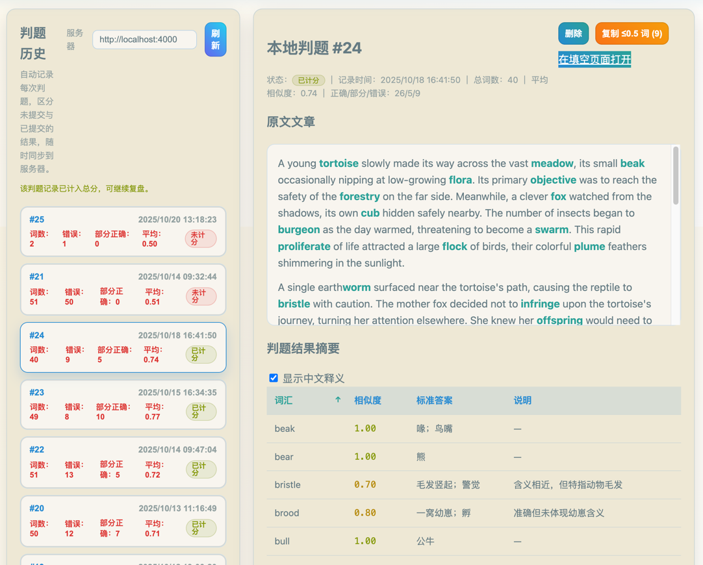
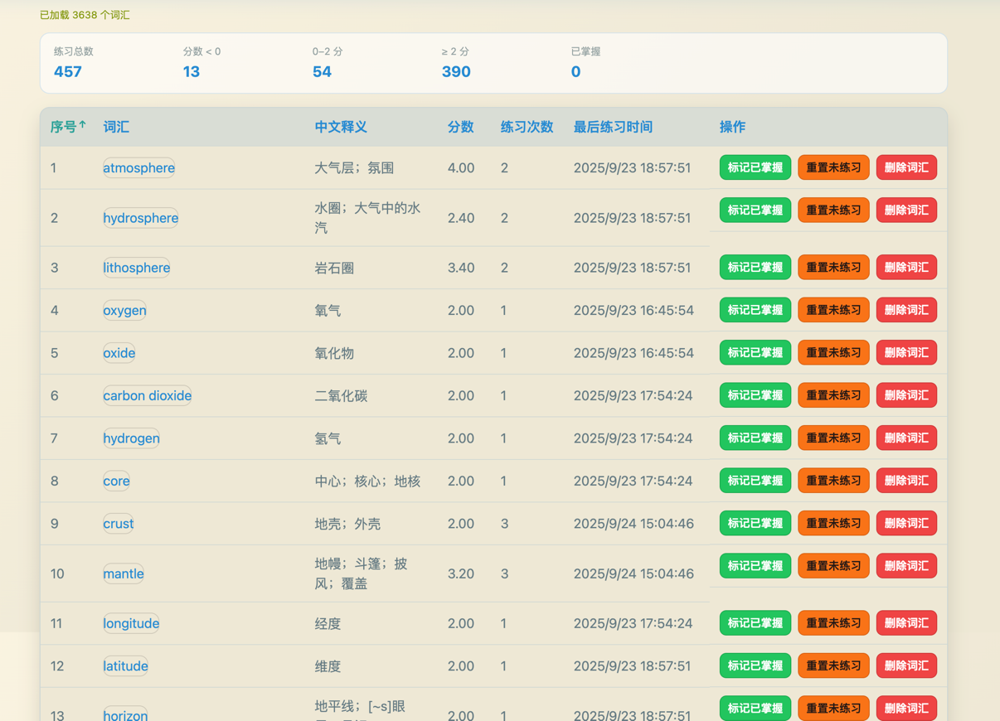

# 阅读学单词

## 项目简介

一个专注于提高阅读识词能力的的网站，核心功能包含 AI 文章生成、AI 判题、做题历史以及词汇掌握度统计。

前端通过静态 HTML 页面配合 Vite 打包的 ES 模块运行，后端提供一个 Node.js + SQLite 的轻量服务用于保存练习成绩与词汇背景信息。

## 环境要求
- Node.js 18 及以上版本，npm
- sqlite3
- 前端功能高度依赖 AI ，**请自行准备可用的 API 与密钥**；模型推荐选择deepseek-v3.1-250821

## 快速开始

### 1. 安装依赖

`npm install`

### 2. 词库

首次启动时，需要 `data/vocabulary.csv` 存在，默认为雅思高频词库，可以自行替换为其它词库。

### 3. 构建前端

`npm run build:frontend`

### 4. 启动后端

`npm start`

### 5. 浏览器访问

`http://localhost:4000`

### 6. AI 配置

点击`AI工具箱`按钮，填入自己的 API 与密钥。

### 7. 自动生成文章

配置所需的单词数量，点击自动取词按钮，然后点击文章生成按钮

进行文章和题目生成需要约1分钟时间，即可开始练习

### 8. 自动判题

完成词汇填空后，点击页面右下角判题按钮，判题约需要1分钟时间

判题结果以标准答案和答案相似度的形式给出，用户可以在判题历史页面回顾本次判题
 
### 9. 分数提交
如果认可本次判题结果，可以在判题历史中点击“计分”按钮，将本次分数纳入总分统计

### 10. 词汇掌握情况

词汇掌握页面可以查看所有单词的分数

